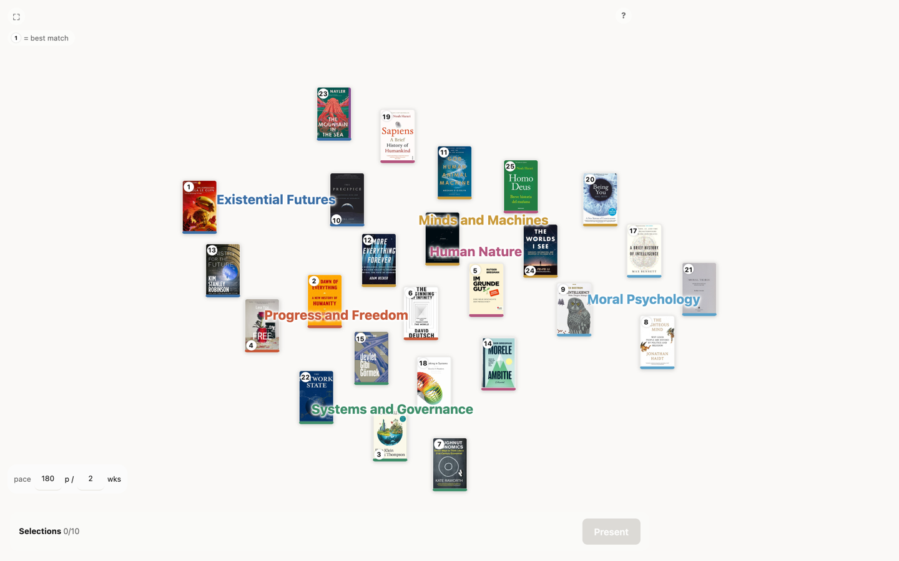

# Was lesen?

*"What shall we read?"* — a companion for a book club that keeps ending up with whatever the
loudest person suggested.

Everyone writes a few sentences about what they'd like to read. Claude proposes real, verified
books that connect those interests, scores each one for each member, and lays them out as a map
you can project on a wall. The group looks at it together and decides. **Claude nominates,
humans choose.**

Works for one person too, if you just want something good to read next.

[](https://was-lesen.onrender.com)

*A real round. **[See it live →](https://was-lesen.onrender.com)** — click any cover for what the
book is about and how well it fits each person.*

---

## How a cycle works

**1 · Ask the group.** A short form: what you feel like reading, a few books you loved, a few
you've already read, anything the group should avoid. Five questions, five minutes to fill in.
There's a ready-made one — **[copy this Tally template](https://tally.so/templates/reading-interests/wdovK3)**
— or write your own; the importer matches columns by what they ask, not by their order.

**2 · Import the answers.** Drop the CSV in. Typo'd titles get fixed, half-remembered ones get
matched against real book catalogs, and you get one card per member to skim and correct. Anyone
who won't be at the next meeting can be skipped — their tastes leave the round entirely.

**3 · Run it.** A few minutes. You'll see it scouting, verifying, and scoring as it goes.

**4 · Look at the map together.** Books sit near others they resemble; the coloured names are
the themes that emerged. Click any cover for what it's about, why it was picked, and how well
it fits each person. The number on a cover is its overall rank.

**5 · Decide in the room.** Collect candidates into the tray as people argue for them, flip
through **Present** for a big-cover view of each, and vote by hand-raise. If someone names a
book that isn't on the map, type it in — it gets checked and scored alongside everything else,
and you'll see exactly where it lands.

**6 · Afterwards, record it.** When you've finished the book, add it under **Past reads** with a
rating and a line about how it went. Next time it's excluded automatically, and what the group
made of it informs the next set of picks.

---

## Try it

You need [Node](https://nodejs.org) 20+ and a Claude subscription with the
[`claude` CLI](https://docs.claude.com/en/docs/claude-code/overview) logged in.

```bash
npm install
cp .env.example .env   # nothing to fill in
npm run dev
```

Open <http://localhost:5173>, add a member or two by hand, and hit **Run**.

**There is no API key.** Runs go through the `claude` CLI you're already signed into, so they
come out of your Claude plan rather than pay-per-token credits.

Pick a quality level before running: **test** is cheap and only good for checking the plumbing,
**standard** is a real answer, **best** is what you'd use for the actual monthly pick.

---

## Sharing a link with the group

Optional, and free. Deploy a copy (there's a one-click [Render](https://render.com) blueprint in
`render.yaml`), then hit **publish** after a run — everyone on the link sees the same map,
read-only, on their phones.

There's nothing to configure and no password anywhere. The deployed copy has no `claude` login,
so it can't run anything; it only shows the map you published. You do the work on your laptop.

**[SETUP.md](SETUP.md) walks through the whole thing end to end** — form questions included — in
about half an hour.

---

## A little about how it works

Books are proposed by two passes over the group's stated interests: one looking for the best
book several people would meet in, one looking for the same thing among books they probably
haven't heard of. Every title is checked against Open Library and Google Books before it can
appear, so an unverified book is flagged rather than quietly invented.

Each book then gets a 1–10 fit per member, anchored in that member's own words, plus a
discussability score. The map's arrangement comes from embeddings — books near each other are
about similar things — and the themes are named from the groups that emerge. All the judgement
happens in prompts; all the arithmetic happens in code, so the ranking is inspectable rather
than vibes.

Your data stays yours: the group's answers never leave your machine, and a published map carries
only what the map shows — names and books, not the paragraphs people wrote.

---

## Commands

```bash
npm run dev         # server on :3000, client on :5173
npm test            # 262 tests
npm run typecheck
npm run build       # build the client
npm start           # serve the built client + API on one port
```
